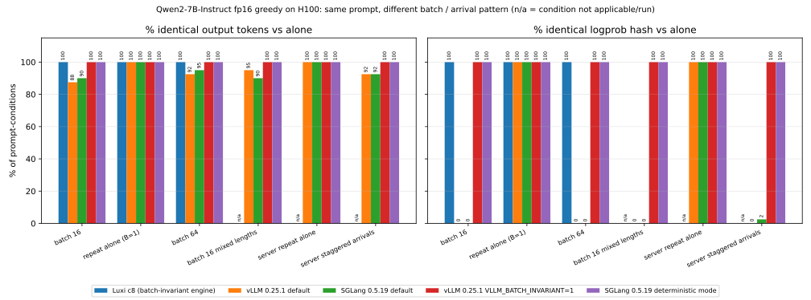

# LuxiEdge inference: Qwen2-7B on H100

**LuxiEdge keeps Qwen2-7B outputs bit-identical across every batch size we tested on an H100, runs at normal serving speed, and is faster and uses less energy than the deterministic modes of vLLM and SGLang in every test we ran.**

Identical outputs usually cost speed: vLLM's batch-invariant mode and SGLang's deterministic mode both run slower than their normal modes. LuxiEdge gives identical outputs at about the speed of normal vLLM 0.25.1 and SGLang 0.5.19.

"Every batch size we tested" means batch 1, 16 and 64 when generating tokens, and batch 1 against 16, 4 and 2 on 2k, 8k and 32k-token prompts, across repeated runs and separate processes. The [drift demo](#drift-demo) below adds batch 16, 32 and 64 on 20 more prompts, and describes one open issue seen in a long-running process. Full scope: [`TEST_SCOPE.md`](TEST_SCOPE.md).

## Results

Each ratio compares Luxi with one engine on the same GPU, in alternating blocks with 6 runs per engine per test. The vLLM and SGLang comparisons come from two different H100 pods, and each row uses only the Luxi runs from its own pod.

| Luxi compared with | Long prompts (2k–32k tokens) | Token generation (1k-token prompt, 256 tokens, batch 1, 16 and 64) |
|---|---|---|
| **Normal modes (not batch-invariant)** | | |
| vLLM 0.25.1 | 3–7% faster, 2–5% less energy per token | Same speed (within 2%), 2–7% more energy per token |
| SGLang 0.5.19 (fp16) | 1.3–4.6% faster, 1.0–4.1% less energy per token | From 1.5% slower (batch 1) to 4.3% faster, 1–7% more energy per token |
| **Deterministic modes** | | |
| vLLM 0.25.1 batch-invariant mode | 6–10% faster, 5–7% less energy per token | 1.5–2.7× faster, 16–50% less energy per token |
| SGLang 0.5.19 deterministic, bf16 | 1.18–1.20× faster, 14–17% less energy per token | 1.21–1.26× faster, 10–13% less energy per token |
| SGLang 0.5.19 deterministic, fp16 | 1.21–1.24× faster, 17–19% less energy per token | 1.72–2.86× faster, 24–51% less energy per token |

The tradeoff: when generating tokens, Luxi uses 1–7% more energy per token than normal vLLM and SGLang. To stay batch-invariant it keeps one matrix-multiply setup per shape at every batch size, while normal vLLM switches to a lower-power setup at batch 1. Details: [Why generation uses more energy](BENCHMARKS.md#why-generation-uses-more-energy).

Normal vLLM and SGLang are not batch-invariant: a prompt's per-step top-5 logprobs changed on 249–254 of 256 steps when it ran inside a batch of 16 or 64 instead of alone.

Energy is GPU board energy (NVML). One model, one GPU type, single-GPU harness; see [`TEST_SCOPE.md`](TEST_SCOPE.md) for what was not tested.

## Details and raw files

- Full tables, method, determinism and correctness checks: [`BENCHMARKS.md`](BENCHMARKS.md)
- What was and wasn't tested: [`TEST_SCOPE.md`](TEST_SCOPE.md)
- vLLM evidence, with per-run rows: [`evidence/h100-qwen2-7b-vs-vllm-0.25.1-2026-09-25/`](evidence/h100-qwen2-7b-vs-vllm-0.25.1-2026-09-25/)
- SGLang evidence, with per-run rows: [`evidence/h100-qwen2-7b-vs-sglang-0.5.19-2026-09-26/`](evidence/h100-qwen2-7b-vs-sglang-0.5.19-2026-09-26/)

## Drift demo

**Under batch load and live-traffic arrivals, normal vLLM and SGLang changed the visible answer in about 8% of prompt-conditions (12 of 140 and 11 of 140). LuxiEdge's output stayed bit-identical in every condition it ran (80 of 80, with the long prompt taken from a fresh-process re-run; see the open issue below), as did the deterministic modes of vLLM and SGLang, while LuxiEdge runs at about the speed of normal vLLM and SGLang (see [Results](#results)).**

What was tested: on one H100 on 2026-09-26, each engine ran Qwen2-7B-Instruct in fp16 with greedy decoding on 20 fixed prompts, 256 tokens each. Every prompt was first run alone. Then the same prompt was run with other work on the GPU: inside a batch of 16 or 64, with two different sets of filler prompts and two row positions, and, for vLLM and SGLang, in a batch with mixed-length fillers and on a live server while other requests were arriving. Each output under load was compared with the same engine's output for that prompt alone: the tokens, the logprobs, and the visible text. When a prompt was simply re-run alone, every engine gave identical output (for LuxiEdge, apart from the long-running-process issue described below). Differences appeared only when other prompts shared the batch or arrived at the same time.

| Engine | Load conditions | Identical tokens | Identical logprobs | Visible answer changed |
|---|---|---|---|---|
| LuxiEdge (Luxi c8) | 80 (batch only) | 80/80 | 80/80 | 0/80 |
| vLLM 0.25.1 default | 140 | 128/140 (91.4%) | 0/140 | 12/140 (8.6%) |
| SGLang 0.5.19 default | 140 | 129/140 (92.1%) | 1/140 | 11/140 (7.9%) |
| vLLM 0.25.1 batch-invariant (`VLLM_BATCH_INVARIANT=1`) | 140 | 140/140 | 140/140 | 0/140 |
| SGLang 0.5.19 deterministic | 140 | 140/140 | 140/140 | 0/140 |

The 80 LuxiEdge conditions are 20 prompts × 4 batch conditions (batch 16 and 64, two filler sets each). On those same 80 conditions, normal vLLM changed the visible answer in 8 and normal SGLang in 6. Normal vLLM's changes were in prompts p02, p07, p08 and p17, with the first different token at position 3 to 47 (median 33). Normal SGLang's were in p02, p04 and p17, at position 40 to 162 (median 153).

Example (normal vLLM, prompt p08, a short reasoning question). Alone, the answer begins "…The second youngest is Erin." In row 0 of a batch of 16 it begins "…The second youngest person is Erin." The first different token is at position 3, and a few more words differ later in the answer. The same change happened in the batch-of-64 run and in one live-server run, but not when the prompt sat in row 8 of the other batch of 16. LuxiEdge's output for this prompt was identical in every condition. More examples: [`examples.md`](evidence/h100-qwen2-7b-drift-demo-2026-09-26/examples.md).

Scope:
- LuxiEdge ran batch conditions only. The benchmarked engine has no server for requests arriving at different times, and its batch API takes equal-length rows, so there are no live-server or mixed-length rows for LuxiEdge.
- For the one long prompt (p20, 1,698 tokens), the "64" conditions used 32 rows for every engine, because of a LuxiEdge buffer limit.
- LuxiEdge logprobs were checked at 9 positions (0, 1, 3, 7, 15, 31, 63, 127 and 255), with the full 152,064-entry logits vector hashed at each one. vLLM and SGLang logprobs cover every position.
- LuxiEdge's drift runs used a 2,048-token decode context, above the 1,280 used in the speed benchmarks. Before the drift runs, LuxiEdge reproduced 11 logits hashes from the speed benchmarks bit for bit.
- One GPU, one model, one dtype, one run.

Open issue: the 19 shorter prompts ran in one long-running LuxiEdge process. When p20 ran next in that same process, after 1,043 earlier calls, its first run alone did not match the fresh-process run described next, its repeat-alone run produced the same tokens as that first run but different logits at all 9 checkpoints, and a later p20 call stopped with a CUDA illegal-memory-access error. All 6 p20 conditions were then re-run in a fresh process, and every token and logits hash matched. The p20 numbers above come from that fresh process and p01–p19 from the long-running process (run before p20), and the faulty records are published in [`raw/luxi_main_process_p20_fault.jsonl`](evidence/h100-qwen2-7b-drift-demo-2026-09-26/raw/luxi_main_process_p20_fault.jsonl). The fault is under investigation.

Method, per-prompt results, scripts and raw records: [`evidence/h100-qwen2-7b-drift-demo-2026-09-26/`](evidence/h100-qwen2-7b-drift-demo-2026-09-26/).

Contact: Eric Waller, e@ewaller.com
