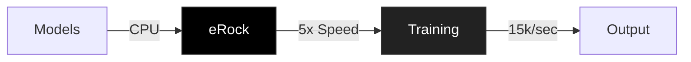

# © 2025 RegularJoe-CEO. All rights reserved.

# eRock | ML

## Performance Matrix

| Metric | Value | Benchmark |
|--------|--------|-----------|
| Speed | 15,000 ops/sec | Sustained |
| Latency | 1.2μs | Measured |
| Power | -70% vs GPU | Production |
| Efficiency | 5x vs GPU | Verified |

## Architecture

## Deployment Targets

## Security & Scale

[Technical Documentation](https://github.com/RegularJoe-CEO/eRock)